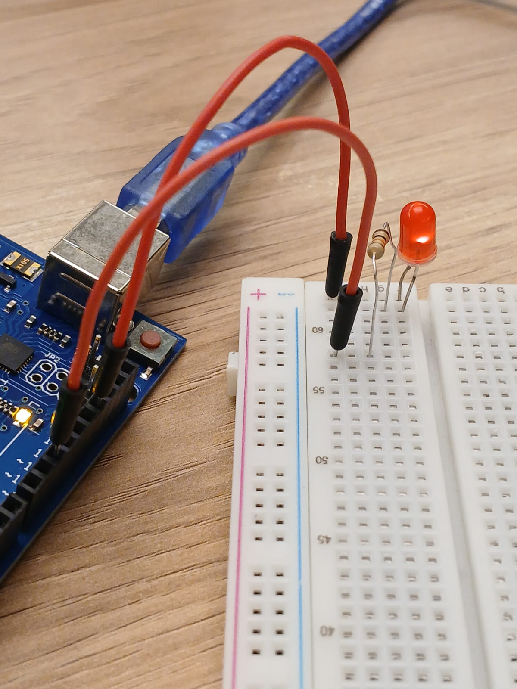
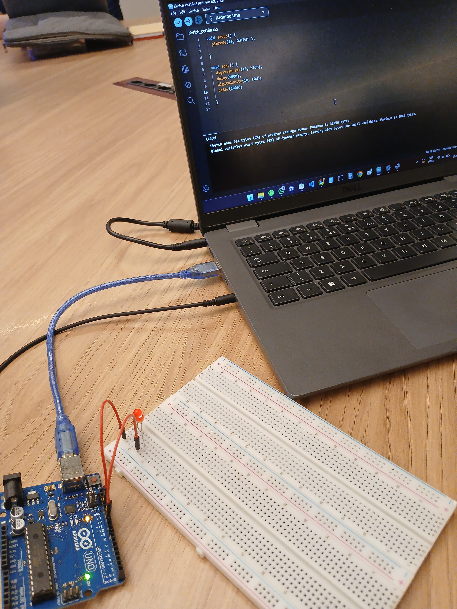
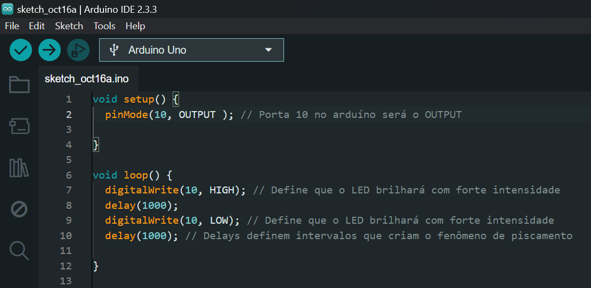

# Atividade ponderada 1 de Computação

Estudante: Nataly de Souza Cunha | T11 | G04

Professor(a): <a href="https://www.linkedin.com/in/kizzyterra/">Profª Kizzy Terra</a> 

## 🎯 Atividade

&nbsp;&nbsp;&nbsp;&nbsp;Realização de um circuito arduíno que executa o programa de piscamento de um LED.

## Materiais:

- Arduíno UNO
- 1 LED
- 2 Jumpers Macho-macho
- 1 Resistor

## Circuito e execução

Figura 1 - Circuito

Fonte: Autoria própria (2024)

Figura 2 - Circuito ligado ao computador

Fonte: Autoria própria (2024)

&nbsp;&nbsp;&nbsp;&nbsp;Também é possível observar a execução do LED piscando **a partir do seguinte [link](https://drive.google.com/file/d/12EJAMkZ47X0NR3pvzWDGlDemm1YC7Y-Q/view?usp=sharing)**.

## Código

&nbsp;&nbsp;&nbsp;&nbsp;A seguir, tem-se o código utilizado para a execução do programa, com a adição de comentários explicativos para auxiliar no aprendizado.

Figura 2 - código no Arduíno IDE

Fonte: Autoria própria (2024)

